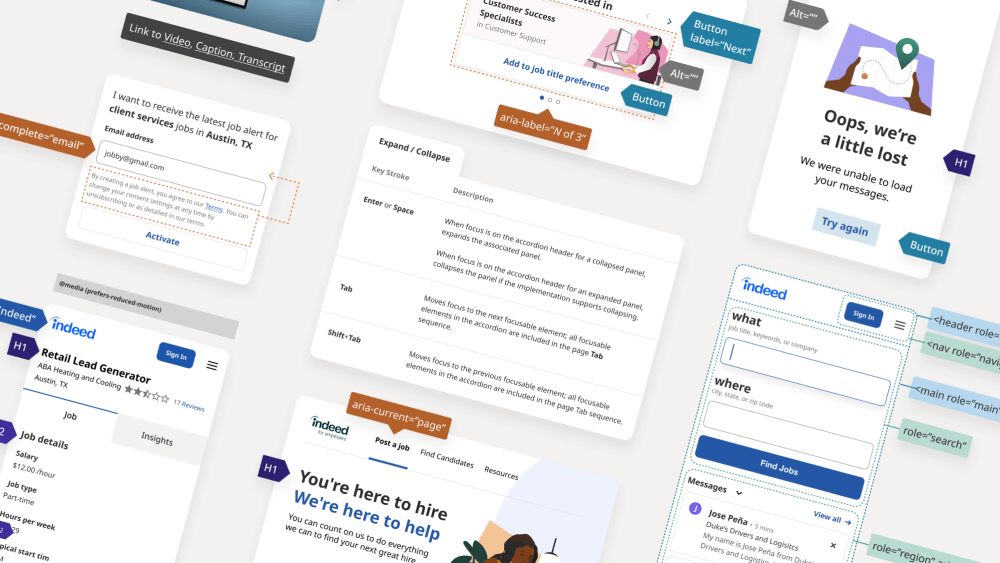
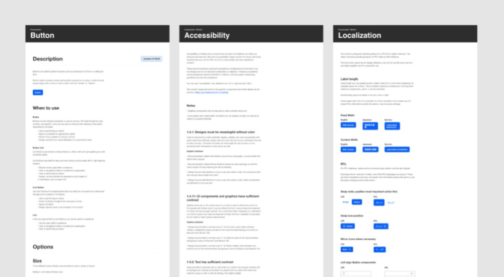
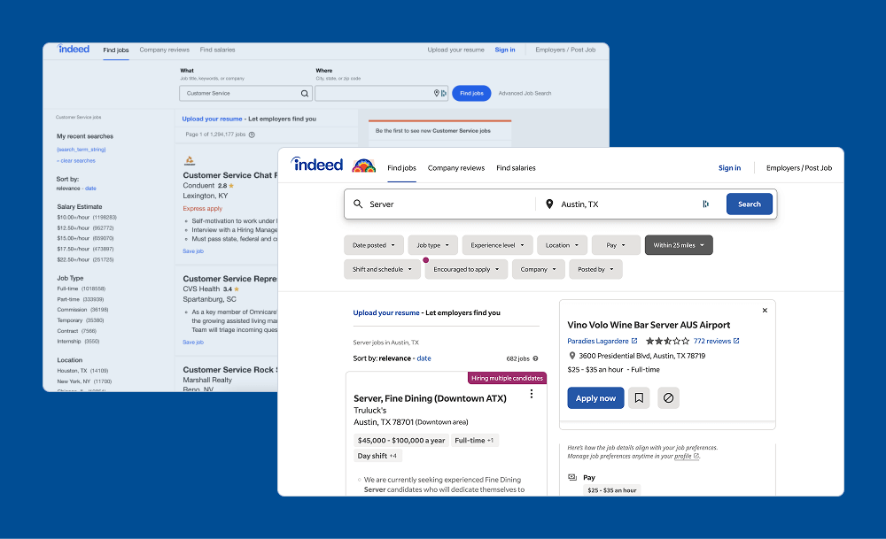

I joined Indeed as a UX Designer to support their internal design system team during a period of rapid growth. Over the course of several months, I helped evolve the system's component library, improved adoption workflows, and guided cross-functional teams on scalable, accessible UI implementation.

## 🧭 Context

The internal design system was in active development and supporting a wide range of consumer and business products. I stepped in to strengthen component quality, shape contribution processes, and help teams align on consistent patterns during a pivotal time in the system's maturity as a rebrand was underway.

## 🛠️ Contributions

I led hands-on updates to the Figma library—refining components for consistency, accessibility, and themeability. I partnered with engineers to ensure parity between design and code, and created detailed documentation to support usage across teams.

To improve efficiency, I introduced a lightweight triage workflow for incoming component requests and contributions. This clarified ownership and reduced friction for designers contributing back to the system.

I also mentored a junior designer new to systems work, helping them develop review skills and take ownership of key parts of the library.

## 📈 Outcomes

By the time I transitioned off the team, the system was more maintainable, better documented, and easier to adopt. System usage had expanded across different product areas, and the contribution process was more approachable for new designers and engineers. The team I supported was better positioned to scale the system going forward.

## 📦 Deliverables

- Updated and documented Figma component library
- Contribution triage process and review workflows
- Collaboration with engineering on implementation specs
- Adoption support for internal product teams
- Mentorship and onboarding for junior design team members
