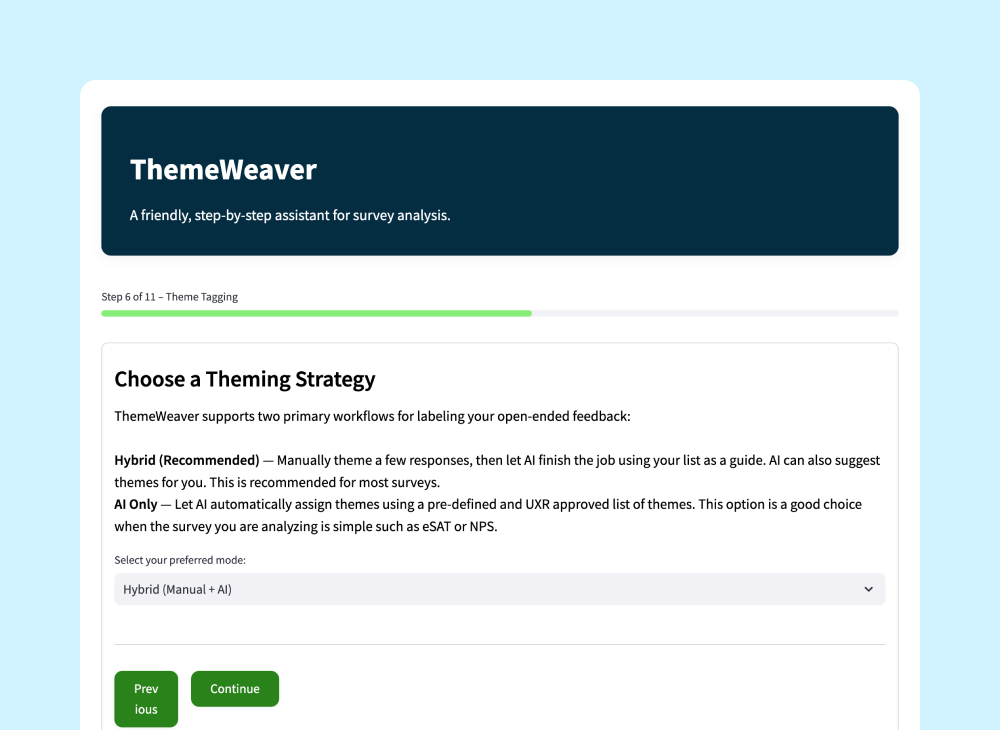
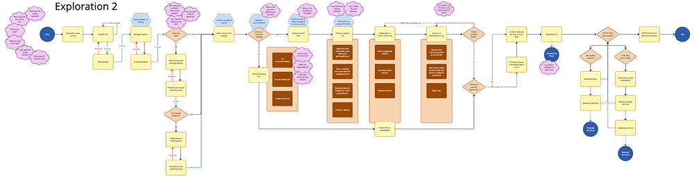
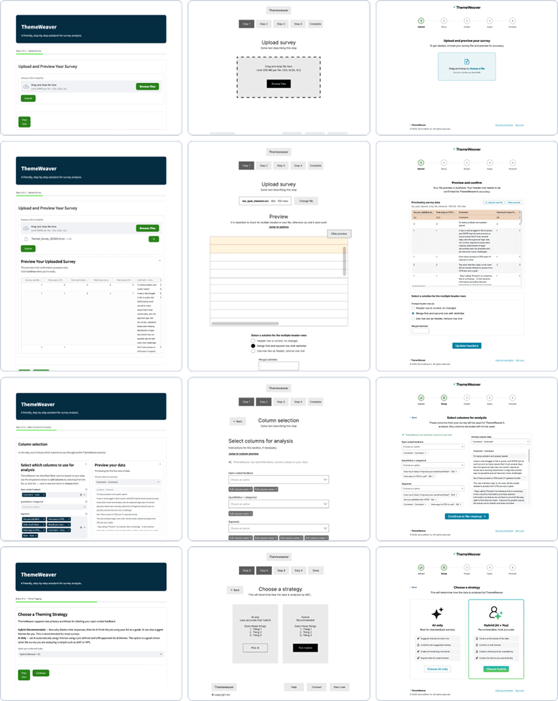
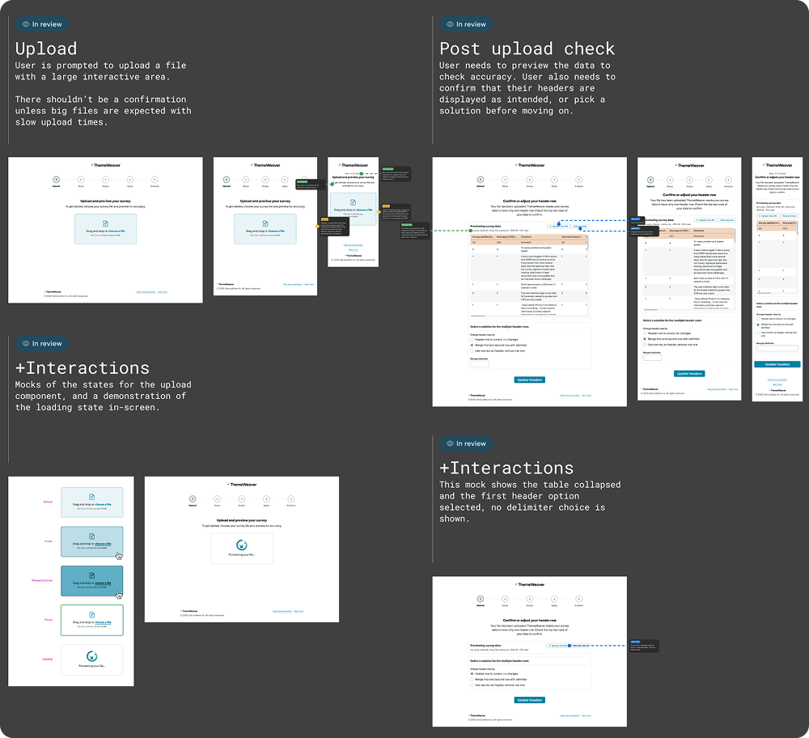
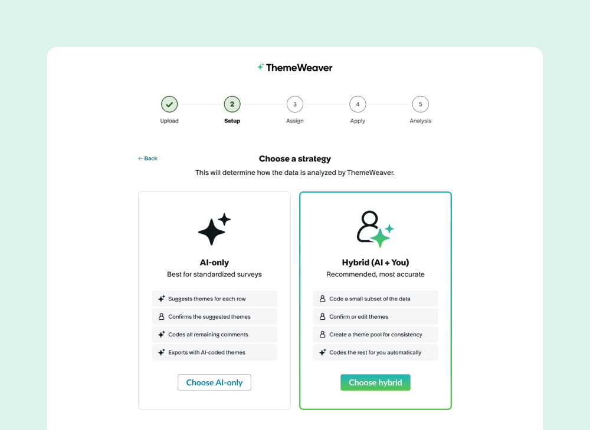

Researchers across the organization were collecting thousands of open-ended responses from surveys, workshops, and interviews. Turning that input into something useful took many hours of manual effort and often got deprioritized.

This project is an internal tool that uses AI to group similar responses and suggest themes with an estimated 95% accuracy rate. I joined the project after the initial prototype was built to help shape the user experience, support implementation, and validate real research use cases.

## 🧭 Context

The first version of the tool was already functional when I joined. I partnered with the original creator to shape the experience around real research workflows, explore the core flow, and identify ways to reduce friction.

Open-ended feedback needs to be coded into themes before it can be analyzed. This process is usually manual and time consuming, often taking 10 hours or more to process just 100 responses. With multiple projects and thousands of inputs, researchers were often overwhelmed.

This tool simplifies that process. Users upload responses, define a few themes, and get a fully coded dataset in return. The goal was to make the workflow faster, easier to navigate, and usable by non-experts, not just trained researchers.

## 🛠️ Contributions

I helped bring structure to an early concept by framing how the experience should adapt to real research scenarios, where inputs are messy and processes aren't always linear.

From there, I simplified the interaction model and reworked how guidance showed up in the tool, making it more focused and less interruptive. I used low-fidelity layouts to shift the conversation toward content and flow, then moved into high-fidelity designs using the internal design system to bring it into the corporate design language.

This work helped the team realign the prototype around actual research behavior and set the foundation for what is now being prepped for user testing.

{corners=square}

## 📈 Outcomes

The updated design helped shape how the team talks about the tool and how it's being built. Several of the interaction and flow changes have already made it into the working prototype.

A demo of the tool, including early flow updates, was presented to senior leadership and received strong support. While design fidelity is currently limited by the prototype platform, the long-term plan is to move to a more flexible system that can better reflect the intended experience.

We're now preparing for user testing. The research will help validate the current flow, guide content updates, and inform the next round of design improvements.

## 📦 Deliverables

- Revised user journey covering key states and branching paths
- Wireframes exploring improved layout and flow
- High-fidelity designs using design system styles and components
- Responsive layouts with annotated interaction and content behavior in Figma
- Ongoing design support and collaboration with research, engineering, and content

